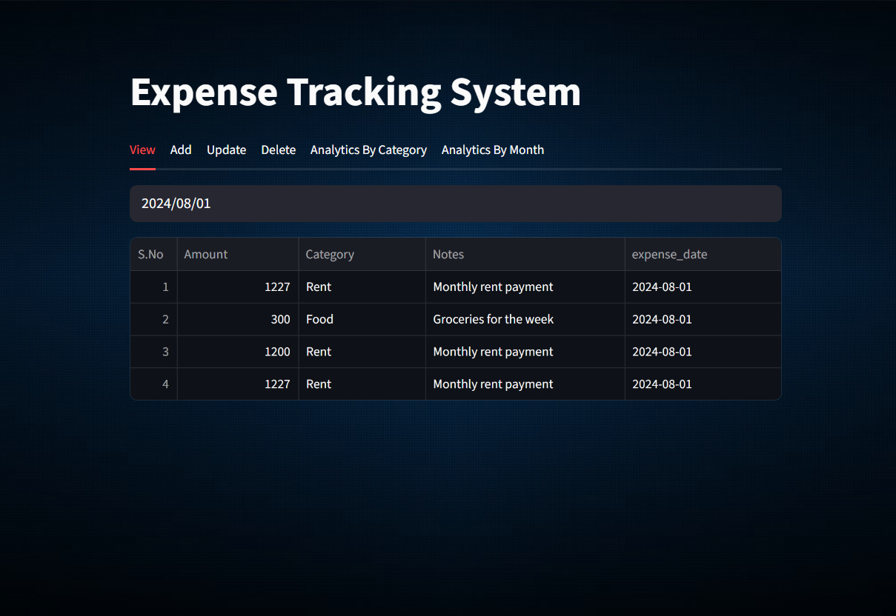
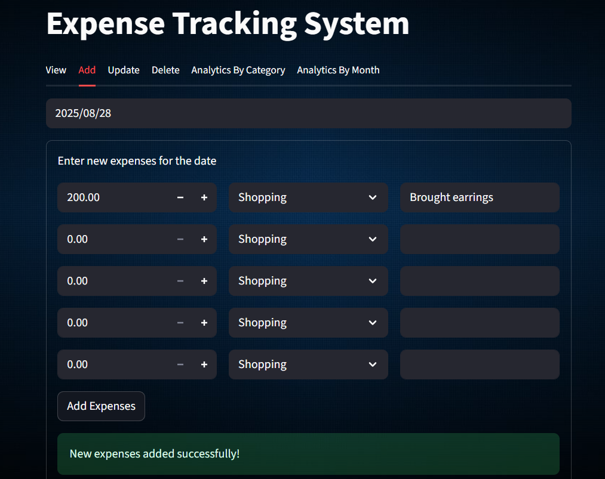
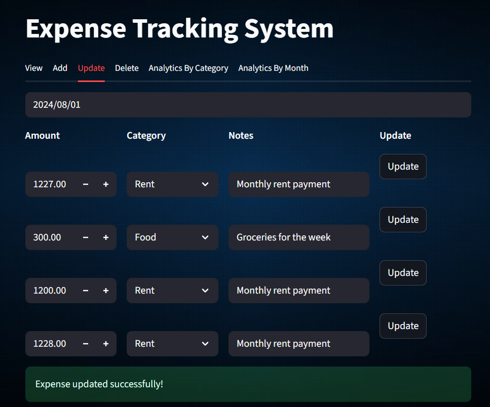
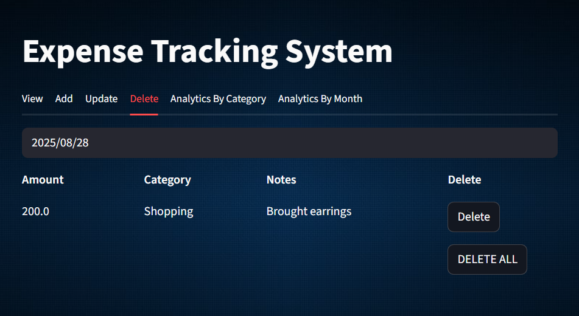
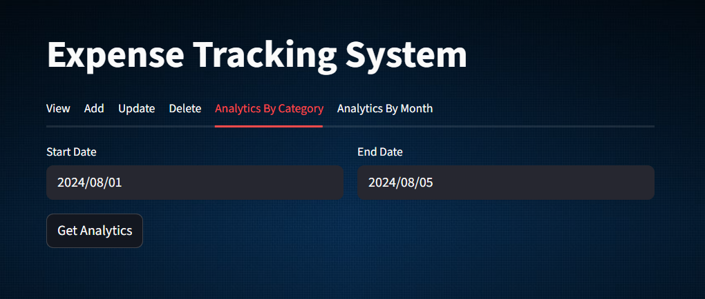
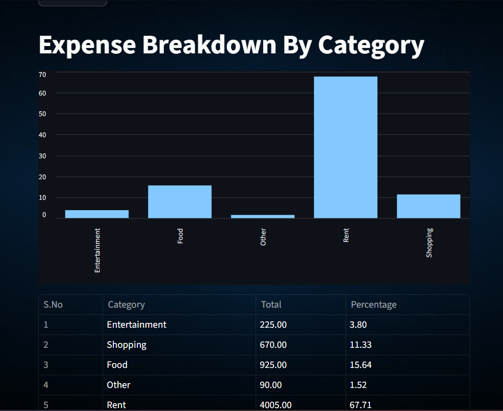
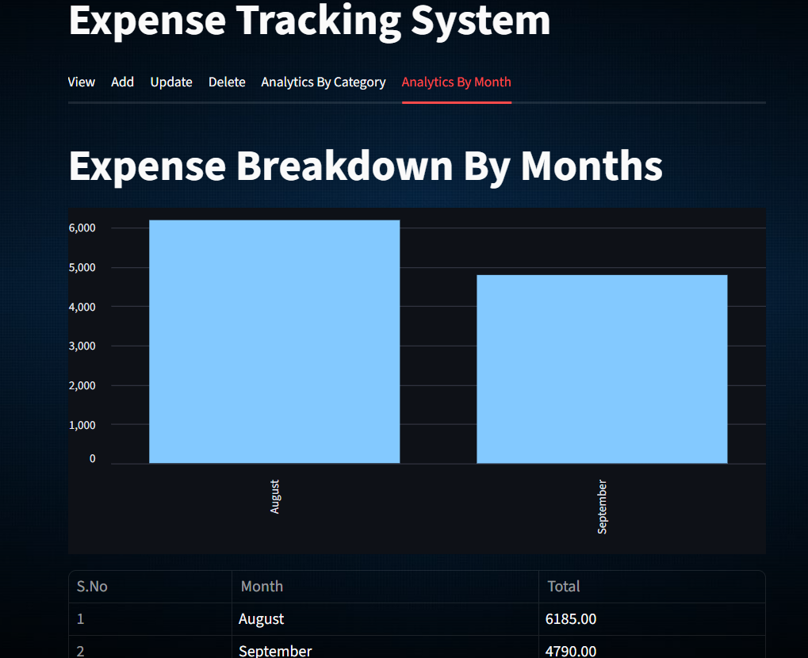

# Expense Management System

This project is an expense management system that consists of a Streamlit frontend application and a FastAPI backend server.
This system allows users to add, view, update, and analyze their daily expenses with a simple and user-friendly interface.

## Features
- **View Expenses (by Date)**:
Select a specific date to view all expenses recorded for that day.

- **Add Expenses**:
Add new expenses for a specific date.

- **Update Expenses**:
Update existing records for a specific date.

- **Delete Expenses**:
Delete row-wise expenses for a date.
Or delete all expenses for a specific date in one click.

- **Analytics by Category**:
Select a date range (start to end).
View total spending for each category.
Bar graph visualization included.

- **Analytics by Month**:
Automatically calculates monthly totals (no input required).
Displays data in a table with a bar graph.


## Project Structure

- **frontend/**: Contains the Streamlit application code.
- **backend/**: Contains the FastAPI backend server code.
- **tests/**: Contains the test cases for both frontend and backend.
- **requirements.txt**: Lists the required Python packages.
- **README.md**: Provides an overview and instructions for the project.

## Screenshots









## How to Use
1. Start the backend server with FastAPI.
2. Run the frontend with Streamlit.
3. Open browser and go to: http://localhost:8501.
4. Use the tabs for different functionalities:
- View Tab → Select a date and view expenses.
- Add Tab → Add expenses for a new date.
- Update Tab → Modify expenses for an existing date.
- Delete Tab → Delete row-wise or all expenses for a date.
- Analytics by Category → Analyze spending by category for a date range.
- Analytics by Month → See month-wise total expenses with bar chart.


## Future Enhancements
-  Add user authentication (login/signup).
-  Export expense reports to CSV/Excel.
-  Add pie charts for category-wise spending.
-  Enable multi-user support (different accounts).
-  Add mobile-friendly UI.


## Setup Instructions

1. **Clone the repository**:
   ```bash
   git clone https://github.com/HarshithaV2002/Expense-Management-System.git  
   cd expense-management-system
   ```

1. **Install dependencies:**:   
   ```commandline
    pip install -r requirements.txt
   ```
1. **Run the FastAPI server:**:   
   ```commandline
    uvicorn server.server:app --reload
   ```
1. **Run the Streamlit app:**:   
   ```commandline
    streamlit run frontend/app.py
   ```